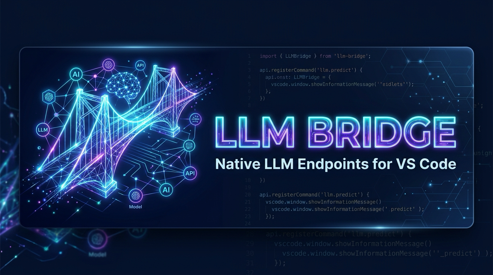
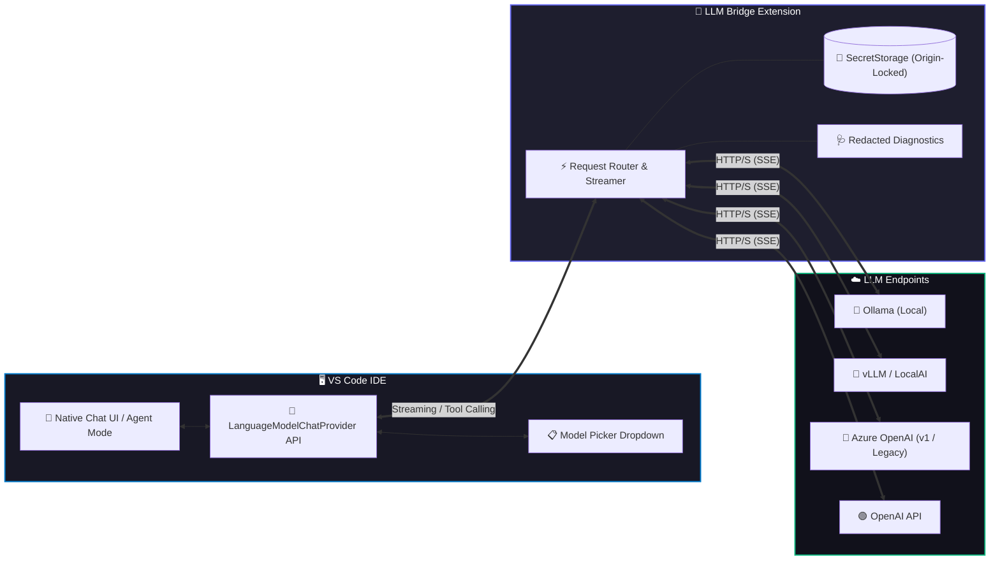

<div align="center">



<br/><br/>

# 🌉 LLM Bridge

### *Seamlessly connect custom LLM endpoints to native VS Code Chat & Agent mode*

Developed with ❤️ by **[IITDEVELOPER](https://github.com/iitdeveloper-git)**

[](https://code.visualstudio.com/)
[](https://github.com/iitdeveloper-git/LLMBridge/blob/main/package.json)
[](https://github.com/iitdeveloper-git/LLMBridge/blob/main/LICENSE)
[](https://www.typescriptlang.org/)
[](#️-security--privacy-first)
[](#-contributing)

<br/>

[🚀 Quick Start](#-quick-start) •
[✨ Key Features](#-key-features) •
[📊 Why LLM Bridge?](#-why-llm-bridge-vs-built-in) •
[🏗️ Architecture](#️-architecture) •
[🌐 Supported Protocols](#-supported-protocols) •
[🛡️ Security Model](#-security--privacy-first) •
[⌨️ Commands](#️-command-palette) •
[🛠️ Development](#️-local-development)

<br/>

</div>

---

Connect your own self-hosted or enterprise LLM endpoints directly to the **native VS Code Chat model picker** using the official [Language Model Chat Provider API](https://code.visualstudio.com/api/extension-guides/ai/language-model-chat-provider).

> [!NOTE]
> **Additive by design:** LLM Bridge registers its own independent vendor (`iitdeveloper-llm-bridge`). It **never** reads, writes, or intercepts GitHub Copilot settings, credentials, telemetry, or completions. Zero Copilot lock-in or dependency.

---

## ✨ Key Features

| Feature | Highlight |
| :--- | :--- |
| 🎯 **Native Experience** | Zero custom webviews or chat tabs. Appears right inside VS Code's native Chat dropdown & Agent Mode. |
| 🔐 **Origin-Bound Vault** | API keys live solely inside VS Code's encrypted `SecretStorage`, strictly bound to the target origin URL. |
| ⚡ **One-Click Discovery** | Automatic `/models` endpoint discovery with fallback to manual model and context sizing. |
| 🧪 **In-Editor Diagnostics** | Real-time connection and inference smoke tests with zero prompt or output leakage. |
| 🦙 **Broad Compatibility** | Speaks the **OpenAI Chat Completions** and **Responses** formats plus **Azure OpenAI (v1 & Legacy)** and **Ollama**'s OpenAI-compatible API. Servers such as vLLM or LocalAI should work if they follow the OpenAI format; verify with *Test Inference*. |
| 📦 **Safe Export/Import** | Share endpoint configurations across your team with automatic credential stripping. |

---

## 📊 How this relates to VS Code's built-in Custom Endpoint

Recent VS Code versions include a built-in Custom Endpoint provider (`chatLanguageModels.json`) for Chat Completions, Responses and Anthropic Messages. **If that is enough for you, use it.** LLM Bridge is for what it does not cover:

- **Azure OpenAI** v1 and legacy deployments, and an **Ollama** setup flow
- **Model discovery** with a manual fallback, plus **connection and inference tests** from the editor
- **Origin-bound credentials**: a stored key is only ever sent to the origin it was entered for
- **User-settings-only endpoints**: workspace settings cannot redirect your key
- **Redacted diagnostics** and **secret-free export/import**

> This is not a feature-by-feature comparison with the built-in provider, which changes between VS Code releases.

---

## 🏗️ Architecture



---

## 🚀 Quick Start

### 1️⃣ Add Endpoint
Press `Ctrl+Shift+P` (or `Cmd+Shift+P` on macOS) and run:
```text
LLM Bridge: Add Endpoint
```
*(Or click the gear icon ⚙️ next to **Manage Models** → **LLM Bridge (IITDEVELOPER)**)*.

### 2️⃣ Configure & Authenticate
Select your protocol, enter a friendly name, provide the base URL, and input your API key. Keys are instantly encrypted and saved to VS Code's `SecretStorage`.

### 3️⃣ Discover & Chat
Models are discovered automatically via `/models`. Open your VS Code Chat panel (`Ctrl+Alt+I` / `Cmd+Ctrl+I`), switch the model picker to your new endpoint, and start prompting!

---

## 🌐 Supported Protocols

| Protocol | Base URL Example | Auth Scheme | Discovery Endpoint |
| :--- | :--- | :---: | :---: |
| `ollama` | `http://localhost:11434/v1` | *None* | `/models` |
| `openai-chat` | `https://api.openai.com/v1` | `Bearer <token>` | `/models` |
| `openai-responses` | `https://api.openai.com/v1` | `Bearer <token>` | `/models` |
| `azure-openai-v1` | `https://RESOURCE.openai.azure.com/openai/v1` | `api-key` or Entra Bearer | `/models` |
| `azure-openai-legacy` | `https://RESOURCE.openai.azure.com` | `api-key` header | *Manual Deployment Entry* |

<details>
<summary><b>📝 Example settings.json configuration</b></summary>

```jsonc
// User Settings (settings.json)
{
  "iitdeveloperLlmBridge.endpoints": [
    {
      "id": "my-local-ollama",
      "name": "Ollama Local",
      "protocol": "ollama",
      "baseUrl": "http://localhost:11434/v1",
      "autoDiscover": true
    },
    {
      "id": "enterprise-vllm",
      "name": "Internal vLLM Cluster",
      "protocol": "openai-chat",
      "baseUrl": "https://llm.corp.internal/v1",
      "models": [
        {
          "id": "qwen2.5-coder-32b",
          "name": "Qwen 2.5 Coder 32B",
          "maxInputTokens": 131072,
          "maxOutputTokens": 8192,
          "toolCalling": true,
          "vision": false
        }
      ]
    }
  ]
}
```
</details>

---

## 🛡️ Security & Privacy-First

Security is baked into LLM Bridge by design, not bolted on as an afterthought:

> [!IMPORTANT]
> **Origin-Locked Secrets:** API keys are cryptographic pairs tied to the exact origin (`protocol + host + port`) entered. If a settings sync or imported configuration alters the base URL, the key is automatically disabled until manually confirmed.

> [!CAUTION]
> **Anti-Hijack Workspace Isolation:** Settings are strictly loaded from **User-level configuration (`globalValue`)**. Untrusted cloned repositories cannot override endpoints or hijack your secrets.

- **🚫 Zero Redirect Key Leakage:** Cross-origin redirects are never followed with authorization headers. Non-307/308 POST redirects are explicitly rejected.
- **🔒 TLS Enforcement:** TLS certificate verification can never be disabled for remote hosts. Insecure plain `http://` is restricted to loopback interfaces (`localhost`, `127.0.0.1`).
- **🩺 Redacted Logs:** Diagnostics and test commands strictly log HTTP status and response lengths. **Your prompts, file contents, code, and completions are never logged or stored.**

---

## ⌨️ Command Palette

Search `LLM Bridge:` in the Command Palette (`Cmd+Shift+P` / `Ctrl+Shift+P`):

| Command | Action |
| :--- | :--- |
| `LLM Bridge: Manage Endpoints` | Interactive dashboard to inspect, test, or reconfigure endpoints |
| `LLM Bridge: Add Endpoint` | Guided wizard for adding Ollama, OpenAI, or Azure targets |
| `LLM Bridge: Remove Endpoint` | Delete an endpoint and prune associated cached metadata |
| `LLM Bridge: Set API Key` | Securely store or update an API key in `SecretStorage` |
| `LLM Bridge: Clear API Key` | Wipe stored API key for an endpoint origin |
| `LLM Bridge: Test Connection` | Health check endpoint reachability and latency |
| `LLM Bridge: Test Inference` | Validate model completion response without leaking data |
| `LLM Bridge: Discover Models` | Fetch available models dynamically via `/models` |
| `LLM Bridge: Add Model Manually` | Define custom model identifier, token limits, and tools |
| `LLM Bridge: Export Configuration` | Export sanitised JSON configuration without secrets |
| `LLM Bridge: Import Configuration` | Safe import with change preview and origin validation |
| `LLM Bridge: Show Diagnostics Log` | Open extension telemetry and troubleshooting output channel |

---

## ⚙️ Capabilities & Technical Specifications

- **Streaming:** Native Server-Sent Events (SSE) streaming with cooperative cancellation and configurable idle/connect timeouts.
- **Resilient Retries:** Intelligent backoff for rate limits (`HTTP 429`) and transient errors (`HTTP 5xx`), honoring `Retry-After` headers.
- **Agent Mode & Tool Calling:** Models declare `toolCalling: true`. LLM Bridge emits standard structured tool calls back to VS Code; execution and user approvals remain 100% under VS Code's native control.
- **Token Estimation:** Fast ~4 chars/token heuristic by default with configurable `maxInputTokens` and `maxOutputTokens`.

---

## ⚠️ Known Limitations

- **Tested against mock servers only.** The protocol adapters are verified with local test servers built from the public wire formats. No real OpenAI, Azure or Ollama endpoint was used in automated tests. Use **Test Inference** on yours.
- **Copilot coexistence is not automatically verified.** Copilot's settings and credentials are never touched (tested in a sandbox without Copilot Chat loaded); check manually that your Copilot models and selection are unchanged.
- **Agent mode depends on the model.** LLM Bridge only returns tool calls to VS Code; VS Code runs tools and approvals. Set `toolCalling: true` only for models that support it. Whether a model works well in Agent mode is not guaranteed.
- **Token counts are estimates** (~4 chars/token). Tool calling and vision are never auto-detected.
- **Not supported yet:** Anthropic Messages, reasoning/thinking output, Bedrock, Vertex. Azure legacy has no model listing: add deployment names manually.
- **Availability** of third-party models in Chat can depend on your VS Code/Copilot plan and organization policy.

---

## 🛠️ Local Development

Ready to contribute or test locally?

### Prerequisites
- Node.js `20.x` or higher
- VS Code `1.104.0` or higher

```bash
# 1. Clone repository & install dependencies
git clone https://github.com/iitdeveloper-git/LLMBridge.git
cd LLMBridge
npm install

# 2. Run full verification suite (types, linter, tests, build)
npm run verify

# 3. Launch Extension Development Host integration tests
npm run test:integration

# 4. Package local VSIX installer
npm run package
code --install-extension llm-bridge-0.1.0.vsix
```

See [REQUIREMENTS-MATRIX.md](docs/REQUIREMENTS-MATRIX.md) for full requirement-to-test traceability.

---

## 🤝 Contributing

Contributions, issues, and feature requests are welcome!

1. Fork the Project
2. Create your Feature Branch (`git checkout -b feature/AmazingFeature`)
3. Commit your Changes (`git commit -m 'Add some AmazingFeature'`)
4. Push to the Branch (`git push origin feature/AmazingFeature`)
5. Open a Pull Request

---

## 📄 License

Distributed under the **MIT License**. See [`LICENSE`](LICENSE) for more information.

<div align="center">

**Built for the Open-Source Community by [IITDEVELOPER](https://github.com/iitdeveloper-git)**

</div>

